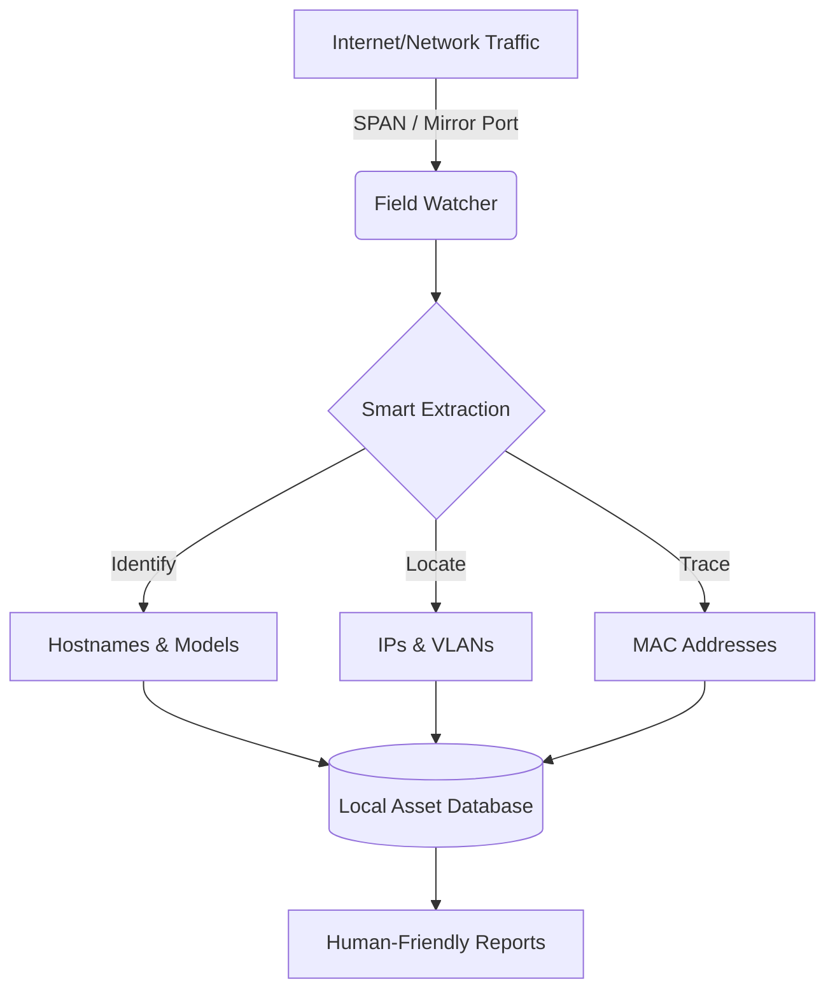

# 📡 Field Watcher

[](https://github.com/pcasaspere/field_watcher/actions/workflows/release.yml)
[](https://buymeacoffee.com/pcasaspere9)

**Field Watcher** is an autonomous network "listener" that automatically discovers every device on your network without ever sending a single packet. It is designed to sit passively on a network port and map out your digital environment in real-time.

Think of it as a **silent digital census** for your network.

> [!TIP]
> **Handcrafted in the Mediterranean 🌊**
> Built with a focus on simplicity, performance, and the philosophy of "it just works". No bloat, no complex configs, just pure network visibility.

## ✨ Why Field Watcher?

-   **🕵️ 100% Passive**: It doesn't "scan" or "ping". It just listens to the natural conversations of the network, making it invisible and safe for sensitive environments.
-   **🤖 Fully Automatic**: You don't need to tell it which network to watch. It figures out the IP ranges, VLANs, and devices on its own.
-   **🔍 Deep Identification**: It extracts device names, manufacturers (like Apple, Cisco, or Tesla), and tracks their movement across different IP addresses.
-   **🏷️ VLAN Aware**: Automatically detects and groups devices by VLAN, including 802.1Q and QinQ (double-tagged) frames.
-   **⚡ High Performance**: Written in **Rust** 🦀, designed to handle high-traffic environments (like data center SPAN ports) while using minimal computer resources.

## 📡 Supported Protocols

| Protocol | What it detects |
| :--- | :--- |
| ARP | IPv4 device presence and MAC-to-IP mappings |
| DHCP | Devices requesting or receiving IP leases |
| DNS | Devices resolving domain names |
| mDNS | Local hostnames (`.local` devices like printers, IoT) |
| LLMNR | Windows hostname resolution |
| NBNS | Legacy NetBIOS name discovery |
| NDP | IPv6 neighbor and router advertisements |
| LLDP | Network infrastructure (switches, APs) |
| CDP | Cisco device identification |

## 🚀 How it works



## 🛠️ Quick Start

> [!IMPORTANT]
> Packet capture requires **root privileges** (or `CAP_NET_RAW` capability). Run with `sudo` or as root.

### 1. Run the Watcher
Start the daemon to begin monitoring your network interfaces:

```bash
# Watch a single interface
sudo ./field_watcher --interface "eth0"

# Watch multiple interfaces at once
sudo ./field_watcher -i "eth0 wlan0"
```

### 2. See the Results
At any time, you can view a clean table of all discovered devices:

```bash
./field_watcher --list
```

Example output:
```
┌──────┬─────────────────┬───────────────────┬──────────────────────┬──────────────┬────────┬─────────────────────┬─────────────────────┐
│ VLAN │ IP Address      │ MAC Address       │ Vendor               │ Hostname     │ Method │ First Seen          │ Last Seen           │
╞══════╪═════════════════╪═══════════════════╪══════════════════════╪══════════════╪════════╪═════════════════════╪═════════════════════╡
│ 1    │ 192.168.1.1     │ AA:BB:CC:11:22:33 │ Cisco Systems        │ gateway      │ ARP    │ 2025-01-15 08:30:00 │ 2025-01-15 10:45:12 │
├──────┼─────────────────┼───────────────────┼──────────────────────┼──────────────┼────────┼─────────────────────┼─────────────────────┤
│      │ 192.168.1.42    │ DD:EE:FF:44:55:66 │ Apple, Inc.          │ macbook-pere │ mDNS   │ 2025-01-15 08:31:00 │ 2025-01-15 10:44:58 │
├──────┼─────────────────┼───────────────────┼──────────────────────┼──────────────┼────────┼─────────────────────┼─────────────────────┤
│ 100  │ 10.0.100.5      │ 11:22:33:AA:BB:CC │ Hewlett Packard      │ printer-lab  │ LLMNR  │ 2025-01-15 09:00:00 │ 2025-01-15 10:30:00 │
└──────┴─────────────────┴───────────────────┴──────────────────────┴──────────────┴────────┴─────────────────────┴─────────────────────┘
```

## 🐧 Running as a Service (Linux)

If you want the watcher to run automatically in the background when your system starts:

1. **Move the binary**: `sudo cp field_watcher-linux-x86_64 /usr/local/sbin/field_watcher`
2. **Create the service file**: `sudo nano /etc/systemd/system/field-watcher.service`

Paste this inside:
```ini
[Unit]
Description=Field Watcher Network Discovery
After=network.target

[Service]
ExecStart=/usr/local/sbin/field_watcher --interface "eth0" --db-path "/var/lib/field_watcher/assets.db"
Restart=always
User=root

[Install]
WantedBy=multi-user.target
```

3. **Start it up**:
```bash
sudo mkdir -p /var/lib/field_watcher
sudo systemctl enable --now field-watcher
```

## ⚙️ Options

| Option | Description |
| :--- | :--- |
| `-i, --interface` | Which network cards to listen on (e.g., `eth0`). |
| `-d, --db-path` | Where to save the discovered data (Default: `/var/lib/field_watcher/assets.db`). |
| `--list` | Show the table of all found devices and exit. |
| `--reset` | Delete all stored data and start fresh. |
| `--verbose` | Show detailed activity logs while running. |

## 📦 Installation

1.  Ensure you have **libpcap** installed on your system.
2.  Build the project: `cargo build --release`.
3.  The binary will be ready at `./target/release/field_watcher`.

---
*Created with ❤️ for network visibility. If you find this tool useful, consider [buying me a coffee](https://buymeacoffee.com/pcasaspere9).*
