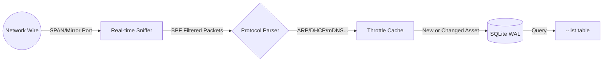

# 📡 Field Watcher

**Field Watcher** is a high-performance, autonomous network discovery tool written in Rust. It is specifically engineered for **SPAN/Mirror port** environments where it can passively monitor network traffic to discover and track local hosts in real-time.

By analyzing Layer 2 and Layer 3 discovery protocols, it builds a comprehensive map of your network assets with zero active scanning (no pings, no port scans).

## ✨ Key Features

-   **🚀 Real-time Discovery**: High-concurrency asynchronous architecture using Tokio and a thread-safe SQLite connection pool.
-   **🤖 Fully Autonomous**: No "target network" configuration required. It observes the wire and identifies every host it sees.
-   **🔍 Protocol Aware**: Prioritizes discovery via:
    -   **Layer 2**: ARP, NDP, CDP, LLDP (including VLAN ID detection).
    -   **Layer 3**: DHCP, DNS, mDNS, LLMNR, NBNS.
-   **🎛️ SPAN Optimized**: Tight BPF (Berkeley Packet Filter) integration ensures only minimal, relevant discovery packets are processed, keeping CPU usage extremely low even on busy ports.
-   **📊 Smart Storage**: Uses a MAC-first UPSERT strategy in SQLite (WAL mode) to track host migration across IPs while preserving "First Seen" timestamps.
-   **🔌 Zero Config**: Designed to run via CLI parameters or Environment Variables.

## 🛠️ Requirements

-   **Rust**: Latest stable version.
-   **libpcap**: Development headers (e.g., `libpcap-dev` on Linux).
-   **Privileges**: Must run as root/sudo to put the interface into promiscuous mode.

## 📦 Installation

```bash
cargo build --release
```
The optimized binary will be available at `./target/release/field_watcher`.

## 🚀 Usage

### Basic Usage Flow


### Real-time Monitoring
Run the daemon on one or more interfaces:

```bash
# Monitor a single interface
sudo ./target/release/field_watcher --interface "eth0"

# Monitor multiple interfaces simultaneously
sudo ./target/release/field_watcher -i "eth0 wlan0" --verbose
```

### Data Inspection
View the discovered hosts in a clean, human-readable table:

```bash
./target/release/field_watcher --list
```

## 🐧 Deployment: Running as a Daemon (Rocky Linux)

To run Field Watcher as a background service on Rocky Linux (or any systemd-based distro):

1. **Build the binary**: `cargo build --release`
2. **Move to system path**: `sudo cp target/release/field_watcher /usr/local/bin/`
3. **Create a service file**: `sudo nano /etc/systemd/system/field-watcher.service`

```ini
[Unit]
Description=Field Watcher Discovery Daemon
After=network.target

[Service]
Type=simple
# Required for packet capture
User=root
ExecStart=/usr/local/bin/field_watcher --interface "eth0" --db-path "/var/lib/field_watcher/assets.db"
Restart=always
RestartSec=5
# Optional: Ensure directory exists
RuntimeDirectory=field_watcher

[Install]
WantedBy=multi-user.target
```

4. **Enable and start**:
```bash
sudo mkdir -p /var/lib/field_watcher
sudo systemctl daemon-reload
sudo systemctl enable --now field-watcher
sudo systemctl status field-watcher
```

## ⚙️ Options

| Option | Environment Variable | Description |
| :--- | :--- | :--- |
| `-i, --interface` | `FW_INTERFACE` | Network interface(s) to sniff on (e.g., "eth0" or "eth0 wlan0"). |
| `-d, --db-path` | `FW_DB_PATH` | Path to the SQLite database (default: `database.db`). |
| `--list` | - | Display all discovered hosts in a formatted table and exit. |
| `--reset` | - | Clear all data from the database and exit. |
| `--verbose` | - | Enable detailed DEBUG logs. |

## 📐 Architecture

-   **`src/domain`**: Business logic and Asset models.
-   **`src/network`**: Highly-optimized Sniffer with protocol-specific heuristics.
-   **`src/storage`**: Concurrent SQLite wrapper with `r2d2` connection pooling and WAL mode.
-   **`src/cli`**: Command-line interface and environment variable mapping.

## 📜 Legacy
The original Python implementation is archived in the `legacy/` directory and preserved in the `v1` branch for historical reference.
